  

  <strong>Building real products across AI automation, commerce and on-chain systems.</strong>

  
  

## Selected systems

<table>
<tr>
<td colspan="2" valign="top">

### GOJO — private AI operations agent

Production Telegram coding agent with persistent memory, guarded GitHub operations, sandboxed execution, multi-agent work and human approval gates.

`TypeScript` `Codex` `Telegram` `SQLite` `Linux sandboxing`

</td>
</tr>
<tr>
<td width="50%" valign="top">

### GMM STORE — commerce platform

Full merch storefront: catalog, checkout, OTP accounts, order lifecycle, ₽/crypto payments and Telegram notifications.

`Next.js 16` `React 19` `Prisma` `PostgreSQL` `YooKassa`

</td>
<td width="50%" valign="top">

### HASHGRID — on-chain GPU economy

Wallet-native mining game with GPU infrastructure, upgrades, degradation and repair, rewards, withdrawals, referrals and achievements.

`Solana` `Anchor` `Rust` `React` `Node.js`

</td>
</tr>
</table>

These systems are private builds; the descriptions reflect working code, not public demo cards.

## Working set

  

## Contribution game

  

  <a href="https://t.me/marcshyne"><strong>MAKE SOMETHING MOVE →</strong></a>

