<p align="center">
  
</p>

<p align="center">
  <a href="https://t.me/marcshyne"></a>
  <a href="https://xgen-ui.vercel.app"></a>
  
</p>

<p align="center"><code>build → automate → ship → repeat</code></p>

<table>
<tr>
<td width="33%" valign="top">

### 01 / AUTOMATE

AI-assisted operations and agent workflows that remove repetitive work.

</td>
<td width="33%" valign="top">

### 02 / CONNECT

Telegram systems, account tooling, and reliable background infrastructure.

</td>
<td width="33%" valign="top">

### 03 / SHIP

Product interfaces that make complex machinery feel simple to operate.

</td>
</tr>
</table>

### TOOLBOX

<p align="center">
  
</p>

### CURRENT SIGNAL

```text
NOW BUILDING   automation-heavy digital products
BASED IN       Saint Petersburg
MODE           shipping > talking
```

### SELECTED BUILD

<a href="https://github.com/marcshyne/xgen-ui"></a>

### CONTRIBUTION FLOW

<picture>
  <source media="(prefers-color-scheme: dark)" srcset="https://raw.githubusercontent.com/marcshyne/marcshyne/output/github-snake-dark.svg" />
  <source media="(prefers-color-scheme: light)" srcset="https://raw.githubusercontent.com/marcshyne/marcshyne/output/github-snake.svg" />
  
</picture>

<p align="right"><sub>4L // BUILT TO MOVE</sub></p>
