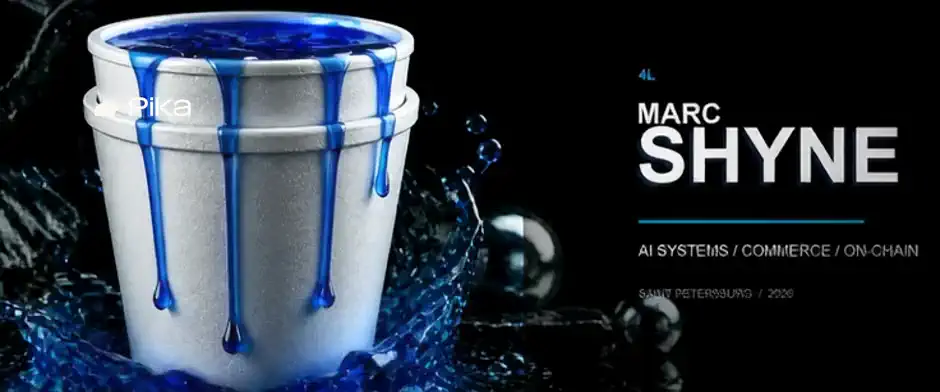

  

  <strong>Building AI workflows, commerce platforms and game systems end to end.</strong>

  
  

## Selected systems

<table>
<tr>
<td colspan="2" valign="top">

### GOJO — AI operations

Private Telegram system for persistent tasks, shared memory, guarded GitHub work and approval-gated content publishing. Its lightweight publishing workflow is live; coding workflows are part of the wider system.

`TypeScript` `Codex` `Telegram` `SQLite` `Linux sandboxing`

</td>
</tr>
<tr>
<td width="50%" valign="top">

### [GMM STORE](https://gmmstore.com) — live commerce platform

Merch storefront with catalog, checkout, customer accounts, order management, payment integrations and interactive 3D product views.

`Next.js` `React` `Prisma` `PostgreSQL` `3D`

</td>
<td width="50%" valign="top">

### Fortune City — Telegram Mini App

Contributed game UI, 3D previews and recoverable funding flows to a Telegram game with a server-side economy and Solana integration.

`Next.js` `NestJS` `Prisma` `PostgreSQL` `Solana`

</td>
</tr>
<tr>
<td width="50%" valign="top">

### Investment Core — local platform

Reusable backend for separate game projects: isolated databases, configurable modules, server-authoritative actions, ledgers and an admin console. Three distinct games are running locally; external payment and deployment acceptance is still pending.

`TypeScript` `Next.js` `PostgreSQL` `Prisma` `Docker`

</td>
<td width="50%" valign="top">

### HASHGRID — on-chain GPU economy

Wallet-connected game with GPU infrastructure, upgrades, repair, rewards, withdrawals and referrals.

`Solana` `Anchor` `Rust` `React` `Node.js`

</td>
</tr>
</table>

Most source repositories are private. Project status is described above; the GMM Store link opens the public site.

## Experience

- **Full-stack products:** React/Next.js interfaces, TypeScript and Python services, PostgreSQL data models, integrations and deployment.
- **AI and Telegram automation:** persistent jobs, shared memory, moderation workflows, guarded agent actions and human approval.
- **Games and payments:** server-authoritative actions, transactional ledgers, recovery flows and Solana/Rust integrations.
- **Interactive 3D:** Blender assets and browser-based viewers for commerce and game interfaces.

## Working set

  

## Contribution game

  

  <a href="https://t.me/marcshyne"><strong>MAKE SOMETHING MOVE →</strong></a>

